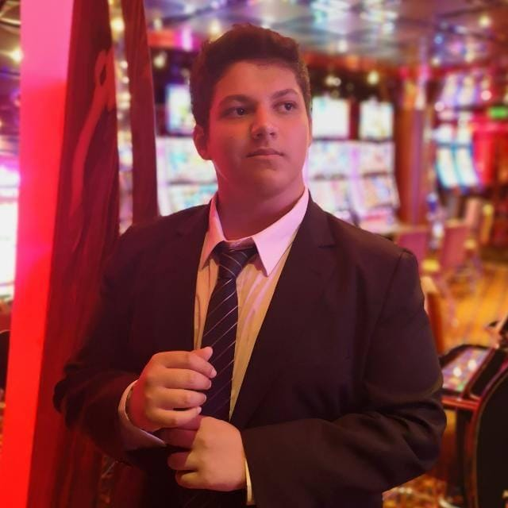

# Programación con objetos I
## Presentación Personal

### Datos Personales
- Hola, mi nombre es Martin Staccia. Tengo 24 años. Este es mi tercer cuatrimestre en esta carrera.
- Yo ya estuve en otra facultad (Universad de Moron, UM) Y estuve en esa por 3 años. Me cambié a la Universidad de Hurlingham porque me queda más cerca y por un problema con una materia que se me hizo demasiado dificil.
- Tengo un conocimiento muy alto de ingles, por no decir perfecto. 
- Tengo conocimiento de programación porque estuve en otra facultad en la cual también estudie sistemas y estuve en una secundaria técnica en la cual también tuve programación.
- Vivo en Hurlingham con mis padres y mi hermana la cual también cursa la misma carrera que yo (Tecnicatura en programación). 

### Otra Información
- Este es mi primer contacto con github.
- Me gustan los videojuegos, especialmente los shooters y los RPGs. Mi perfil de Steam: https://steamcommunity.com/id/LukasTrotacielo/
- Soy diestro.
- Me gusta mucho Star Wars.
- Soy hincha de River.
- Me gusta escuchar hip hop. Mi playlist de Spotify: https://open.spotify.com/playlist/5jxskhNZPKqRZQ9Bvy1A1A?si=8764e07120464bab
